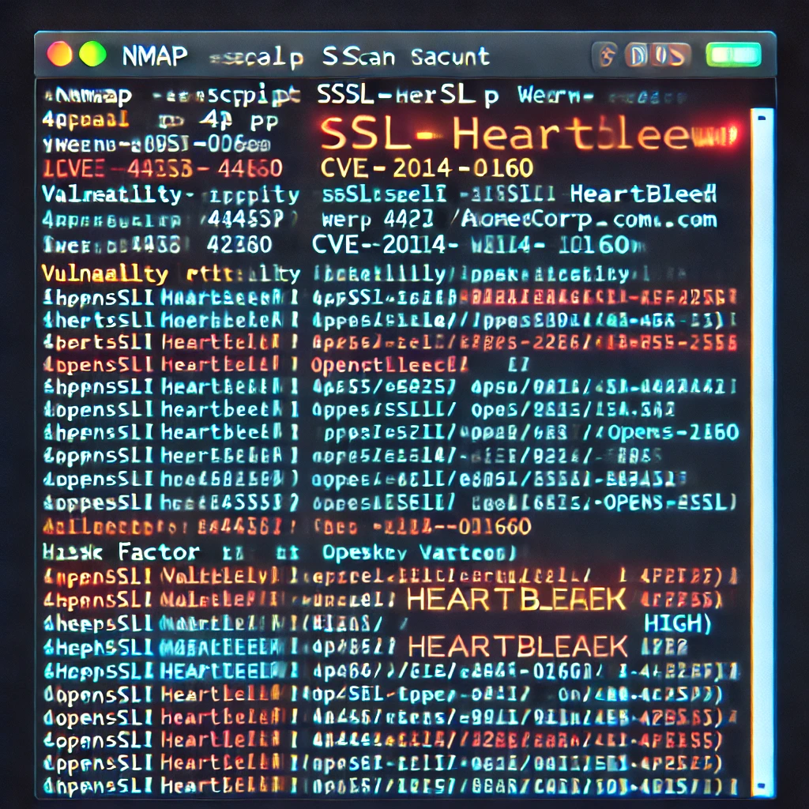

### Finding 2: Outdated OpenSSL Version on Server

**Severity:** High

**Description:**

The web server at **www.acmecorp.com** is running OpenSSL version 1.0.1, which is susceptible to the Heartbleed vulnerability (CVE-2014-0160).

**Evidence:**

- Detected OpenSSL 1.0.1 via service fingerprinting.
- Successfully exploited using Heartbleed exploit tools.
- Extracted fragments of server memory, including session cookies and private keys.

**Impact:**

- Exposure of sensitive data in server memory.
- Potential decryption of SSL/TLS traffic.
- Compromise of secure communications.

**Recommendation:**

- Upgrade OpenSSL to the latest stable version.
- Replace SSL/TLS certificates after updating.
- Perform a security audit of systems for any signs of compromise.

**References:**

- [Heartbleed Bug Information](https://heartbleed.com/)

**Screenshot:**

