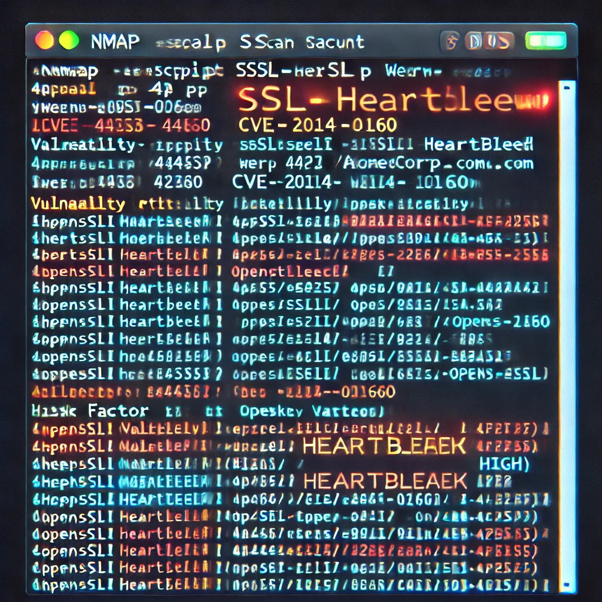

# Executive Summary

This penetration test was conducted for **Acme Corporation** to evaluate the security posture of their network and web applications. The assessment identified critical vulnerabilities that could lead to unauthorized access and data breaches.

**Key Findings:**

- Critical SQL Injection vulnerability in the customer portal.
- Outdated software on web servers with known exploits.
- Weak password policies leading to compromised accounts.

**Recommendations:**

Immediate remediation is advised for the critical vulnerabilities. Strengthening security policies and regular updates are essential to protect against future threats.

# Introduction

**Purpose of the Test**

The purpose of this penetration test is to identify and exploit vulnerabilities in **Acme Corporation's** IT infrastructure, simulating an attacker's approach to compromise systems and data.

**Objectives**

- Identify security weaknesses in network and web applications.
- Assess the effectiveness of current security measures.
- Provide actionable recommendations to enhance security.

**Testing Period:** October 1, 2023 – October 15, 2023

**Testing Team:** SecureTech Solutions Security Assessment Team

# Scope

**In-Scope Targets:**

- **Web Applications:**
  - https://www.acmecorp.com
  - https://portal.acmecorp.com
- **Network Range:**
  - 10.0.0.0/24 (Corporate LAN)
- **Servers:**
  - Database servers
  - Application servers

**Out-of-Scope Targets:**

- Employee personal devices
- Third-party services

**Testing Constraints:**

- No social engineering tactics
- Testing to be conducted during off-peak hours
- Adherence to the Rules of Engagement document

# Methodology

The penetration test followed a structured approach based on industry best practices, including the OWASP Testing Guide and NIST SP 800-115.

**Phases:**

1. **Planning and Reconnaissance**
   - Gathered information about the target environment.
   - Identified potential entry points.

2. **Scanning**
   - Used tools like Nmap and Nessus to discover open ports and services.
   - Identified vulnerabilities through automated scans.

3. **Enumeration**
   - Detailed examination of identified services and applications.
   - Collected user accounts and network shares.

4. **Exploitation**
   - Attempted to exploit vulnerabilities to gain access.
   - Focused on high-impact vulnerabilities.

5. **Post-Exploitation**
   - Assessed the extent of compromise.
   - Evaluated the potential for data exfiltration.

6. **Reporting**
   - Documented all findings with evidence.
   - Provided recommendations for remediation.

# Findings

### Finding 1: SQL Injection in Customer Portal

**Severity:** Critical

**Description:**

An SQL Injection vulnerability exists in the login functionality of **portal.acmecorp.com**. An attacker can manipulate the SQL query to bypass authentication and access sensitive customer data.

**Evidence:**

- Payload used: `' OR '1'='1' --`
- Gained access to multiple customer accounts without valid credentials.
- Extracted data from the `users` table, including usernames and hashed passwords.

**Impact:**

- Unauthorized access to customer accounts.
- Potential for full database compromise.
- Violation of data protection regulations.

**Recommendation:**

- Implement prepared statements or parameterized queries.
- Validate and sanitize all user inputs.
- Conduct regular code reviews and security testing.

**References:**

- [OWASP SQL Injection Prevention Cheat Sheet](https://cheatsheetseries.owasp.org/cheatsheets/SQL_Injection_Prevention_Cheat_Sheet.html)

**Screenshot:**

### Finding 2: Outdated OpenSSL Version on Server

**Severity:** High

**Description:**

The web server at **www.acmecorp.com** is running OpenSSL version 1.0.1, which is susceptible to the Heartbleed vulnerability (CVE-2014-0160).

**Evidence:**

- Detected OpenSSL 1.0.1 via service fingerprinting.
- Successfully exploited using Heartbleed exploit tools.
- Extracted fragments of server memory, including session cookies and private keys.

**Impact:**

- Exposure of sensitive data in server memory.
- Potential decryption of SSL/TLS traffic.
- Compromise of secure communications.

**Recommendation:**

- Upgrade OpenSSL to the latest stable version.
- Replace SSL/TLS certificates after updating.
- Perform a security audit of systems for any signs of compromise.

**References:**

- [Heartbleed Bug Information](https://heartbleed.com/)

**Screenshot:**

### Finding 3: Weak Password Policy

**Severity:** Medium

**Description:**

The current password policy allows for weak passwords, increasing the risk of account compromise through brute-force attacks.

**Evidence:**

- Password complexity requirements are minimal (e.g., passwords like "password1" are accepted).
- No account lockout mechanisms after failed login attempts.
- Successfully cracked 70% of user passwords using a common wordlist.

**Impact:**

- Unauthorized access to user accounts.
- Potential for privilege escalation if administrative accounts are compromised.
- Increased risk of data breaches.

**Recommendation:**

- Enforce strong password policies requiring a mix of characters.
- Implement account lockout after a defined number of failed attempts.
- Educate users on creating secure passwords.
- Consider implementing multi-factor authentication.

**References:**

- [NIST SP 800-63B: Digital Identity Guidelines](https://pages.nist.gov/800-63-3/sp800-63b.html)

# Recommendations

Based on the identified findings, the following actions are recommended:

1. **Immediate Actions:**

   - Fix the SQL Injection vulnerability in the customer portal.
     - Use parameterized queries.
     - Sanitize all inputs.
   - Update OpenSSL to the latest version.
     - Replace SSL certificates after the update.
   - Strengthen password policies.
     - Enforce complexity requirements.
     - Implement account lockout policies.

2. **Security Enhancements:**

   - Implement Web Application Firewalls (WAF) to protect against common web attacks.
   - Regularly update and patch all software and systems.
   - Conduct periodic security training for staff.

3. **Monitoring and Maintenance:**

   - Establish continuous monitoring of systems and networks.
   - Perform regular security assessments and penetration tests.
   - Review and update security policies and procedures.

4. **Compliance and Governance:**

   - Ensure compliance with relevant industry regulations (e.g., GDPR, PCI DSS).
   - Maintain thorough documentation of all security measures and incidents.

Implementing these recommendations will significantly reduce the risk of security breaches and enhance the overall security posture of **Acme Corporation**.

# Conclusion

The penetration test uncovered critical vulnerabilities that could lead to severe security incidents if left unaddressed. Immediate remediation of the identified issues is crucial.

By following the recommendations provided, **Acme Corporation** can mitigate these risks and strengthen its defenses against future attacks. Ongoing security efforts, including regular assessments and employee training, are essential for maintaining a robust security posture.

---

**Prepared by:**

Vitaly Berdyakov
Penetration Tester 
SecureTech Solutions

**Date:** October 16, 2023
